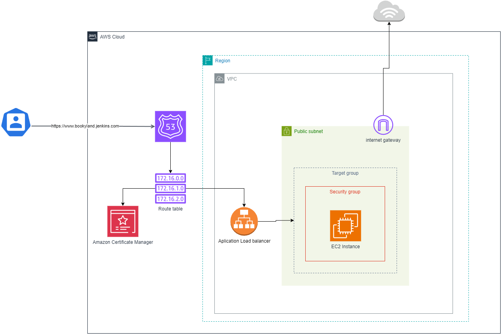
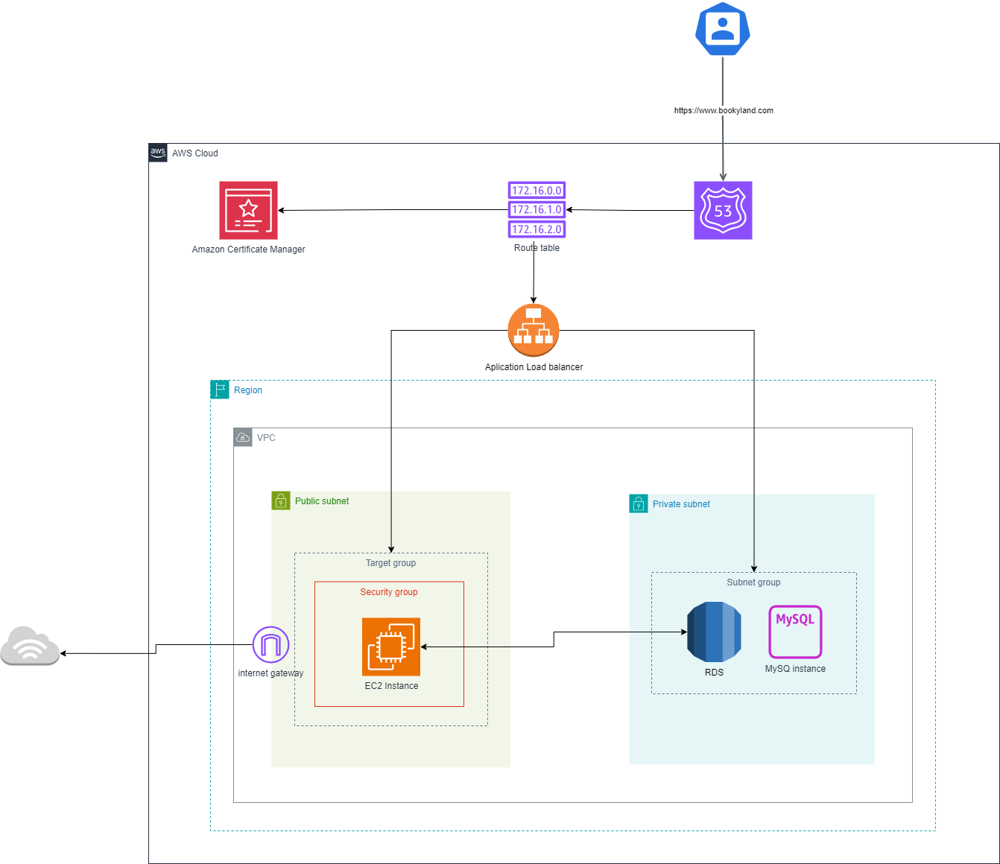
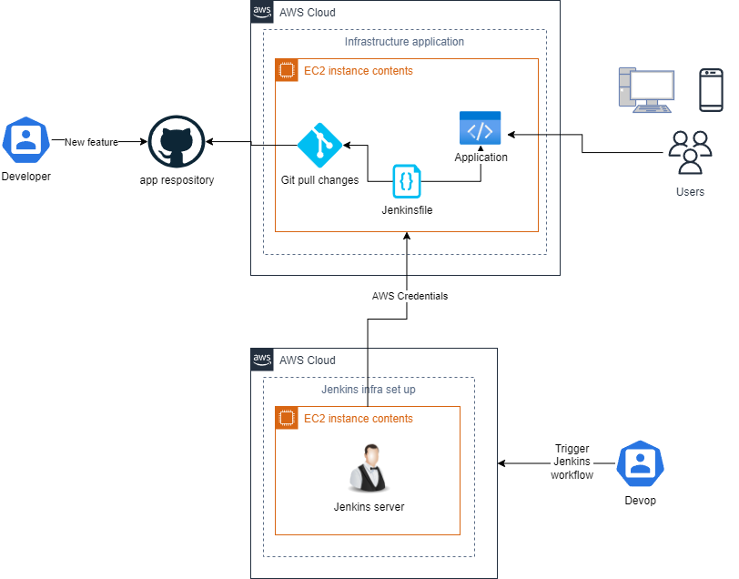

# CI/CD through Jenkins in AWS cloud

This project creates infra for setting up Jenkins in order to create a pipeline for deploy resources and new features into AWS cloud.

AWS resources:

* EC2 (t2.medium, t2.micro)
* ALB
* Security groups
* VPC
* Internet Gateway (IG)
* RDS + MySQL
* Route 53
* ACM

## General diagram architecture for Jenkins set up

## API REST Application infrastructure

## CI/CD Flow

